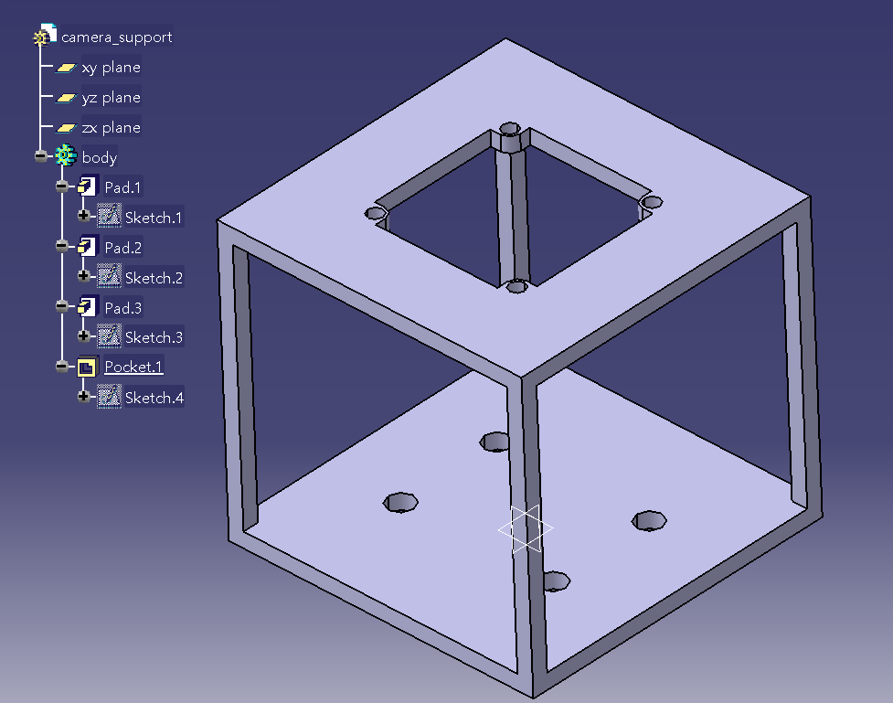

# 3D printer

Using CAD/CAM sotfware and 3D printer, Make a camera support

## CAD/CAM software : CATIA V5 R18

* camera_support.CATPart
* camera_support.PNG
* camera_support.stl

</img>

* you can see **.stl** file directly in below site

https://github.com/Jstar0525/Jetson-TX2-Project/blob/master/3D%20printer/camera_support.stl

## 3D printer : CUBICON singel 3DP-110F

* cubicon single 3DP-110F.PNG

</img>

* The guide document for 3D printer is in **Guide** folder 

* camera_support(3DP-110F_PLA).hvs

## Result

* result.jpg

</img>
